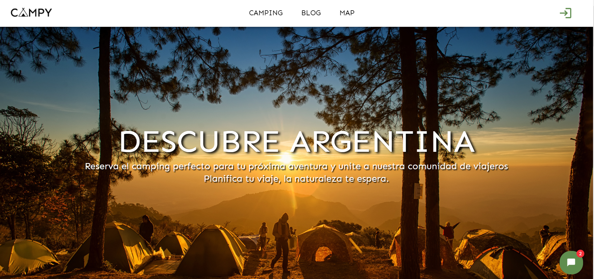
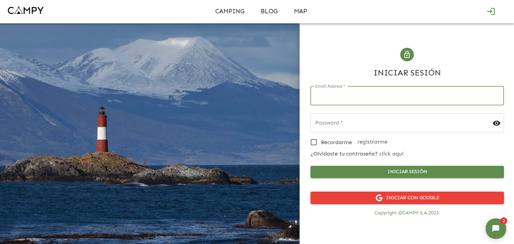
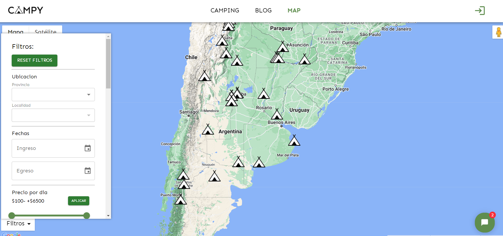
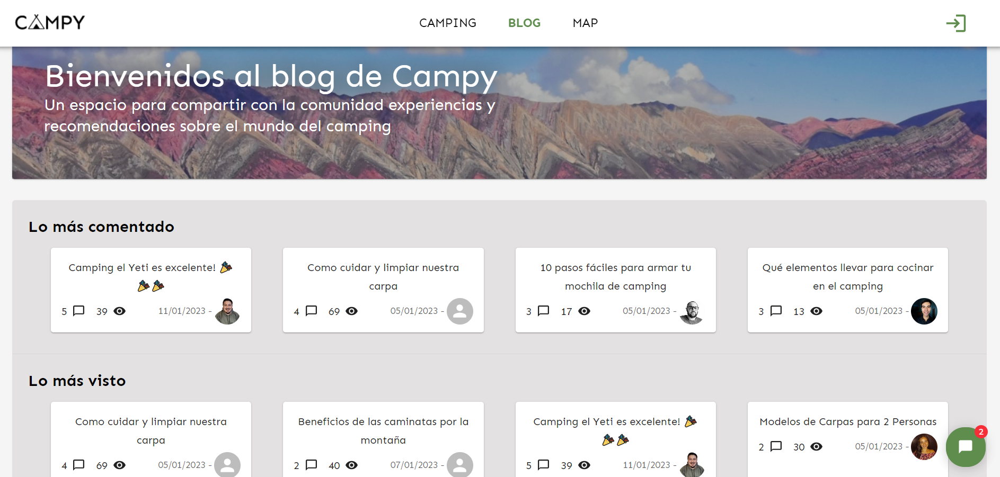
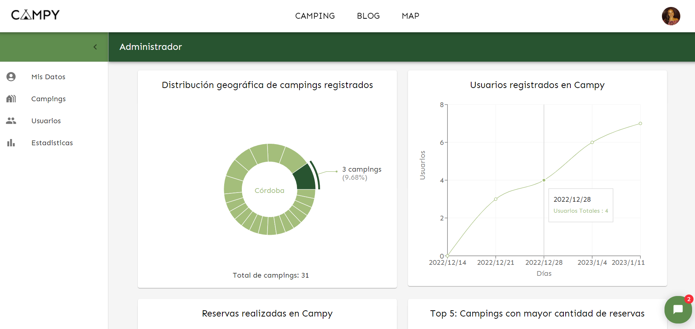
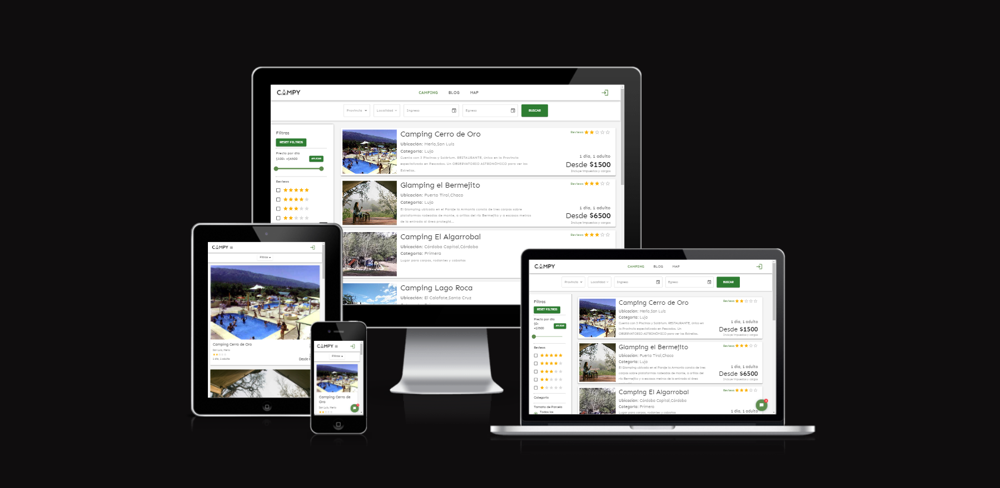

### 

<h3 align="center"><strong>A creative JavaScript FullStack developer 👩‍💻</strong></h3>
<h4 align="center">Always open to new opportunities and experiences where I can demonstrate my skills and learn new technologies, to grow both professionally and personally. 🚀</h4>

- 🌱 I’m currently learning **NextJS**

- 👨‍💻 All of my projects are available at [https://github.com/augusto2304](https://github.com/augusto2304)

<!--
CONTACTO
-->

<h4><strong>Connect with me:</strong></h4>

## Languages and Tools

 
<!-- html -->
               

  

## Github Stats  

  

   

## Projects

### Food App 

~~~
📌 Henry Bootcamp Individual Project 

Design and develop a web page about recipes including:
✔ Landing page
✔ Searchbar
✔ Filtering, Sorting and Pagination
✔ Recipe´s detail
✔ Option to create a new recipe

Tech Utils: 
🔹 Javascript
🔹 Front: React, Redux, plain CSS .
🔹 Back: Node.js, Express.
🔹 Database: PostgreSQL, Sequelize.

~~~

____________________
### Campy

~~~
📌 Final group project of Bootcamp Henry.

A booking app for campings in Argentina 

Design and develop a web page about campings including:
✔ Complex filters
✔ Map
✔ Authentication
✔ Bot
✔ Blog
✔ Different dashboards

Tech Utils:
🔹 Typescript
🔹 Front: React JS, Redux, Material-UI
🔹 Back: NodeJs, Express, Sequelize
🔹 Database: MySQL
~~~
👉Deploy: https://campy-frontend.vercel.app/

<h2>
Home --- Login
</h2>

<h2>
Booking --- Map
</h2>

  

<h2>
Blog --- Dashboard
</h2>

<h2>
Responsive Design
</h2>

___________________________________________

## 📫 CONTACT ME

**Email:** augusto.alvarez2304@yahoo.com

### 

<h3 align="center"><strong>A creative JavaScript FullStack developer 👩‍💻</strong></h3>
<h4 align="center">Always open to new opportunities and experiences where I can demonstrate my skills and learn new technologies, to grow both professionally and personally. 🚀</h4>

- 🌱 I’m currently learning **NextJS**

- 👨‍💻 All of my projects are available at [https://github.com/augusto2304](https://github.com/augusto2304)

<!--
CONTACTO
-->

<h4><strong>Connect with me:</strong></h4>

## Languages and Tools

 
<!-- html -->
               

  

## Github Stats  

  

   

## Projects

### Food App 

~~~
📌 Henry Bootcamp Individual Project 

Design and develop a web page about recipes including:
✔ Landing page
✔ Searchbar
✔ Filtering, Sorting and Pagination
✔ Recipe´s detail
✔ Option to create a new recipe

Tech Utils: 
🔹 Javascript
🔹 Front: React, Redux, plain CSS .
🔹 Back: Node.js, Express.
🔹 Database: PostgreSQL, Sequelize.

~~~

____________________
### Campy

~~~
📌 Final group project of Bootcamp Henry.

A booking app for campings in Argentina 

Design and develop a web page about campings including:
✔ Complex filters
✔ Map
✔ Authentication
✔ Bot
✔ Blog
✔ Different dashboards

Tech Utils:
🔹 Typescript
🔹 Front: React JS, Redux, Material-UI
🔹 Back: NodeJs, Express, Sequelize
🔹 Database: MySQL
~~~
👉Deploy: https://campy-frontend.vercel.app/

<h2>
Home --- Login
</h2>

<h2>
Booking --- Map
</h2>

  

<h2>
Blog --- Dashboard
</h2>

<h2>
Responsive Design
</h2>

___________________________________________

## 📫 CONTACT ME

**Email:** augusto.alvarez2304@yahoo.com

### 

<h3 align="center"><strong>A creative JavaScript FullStack developer 👩‍💻</strong></h3>
<h4 align="center">Always open to new opportunities and experiences where I can demonstrate my skills and learn new technologies, to grow both professionally and personally. 🚀</h4>

- 🌱 I’m currently learning **NextJS**

- 👨‍💻 All of my projects are available at [https://github.com/augusto2304](https://github.com/augusto2304)

<!--
CONTACTO
-->

<h4><strong>Connect with me:</strong></h4>

## Languages and Tools

 
<!-- html -->
               

  

## Github Stats  

  

   

## Projects

### Food App 

~~~
📌 Henry Bootcamp Individual Project 

Design and develop a web page about recipes including:
✔ Landing page
✔ Searchbar
✔ Filtering, Sorting and Pagination
✔ Recipe´s detail
✔ Option to create a new recipe

Tech Utils: 
🔹 Javascript
🔹 Front: React, Redux, plain CSS .
🔹 Back: Node.js, Express.
🔹 Database: PostgreSQL, Sequelize.

~~~

____________________
### Campy

~~~
📌 Final group project of Bootcamp Henry.

A booking app for campings in Argentina 

Design and develop a web page about campings including:
✔ Complex filters
✔ Map
✔ Authentication
✔ Bot
✔ Blog
✔ Different dashboards

Tech Utils:
🔹 Typescript
🔹 Front: React JS, Redux, Material-UI
🔹 Back: NodeJs, Express, Sequelize
🔹 Database: MySQL
~~~
👉Deploy: https://campy-frontend.vercel.app/

<h2>
Home --- Login
</h2>

<h2>
Booking --- Map
</h2>

  

<h2>
Blog --- Dashboard
</h2>

<h2>
Responsive Design
</h2>

___________________________________________

## 📫 CONTACT ME

**Email:** augusto.alvarez2304@yahoo.com

